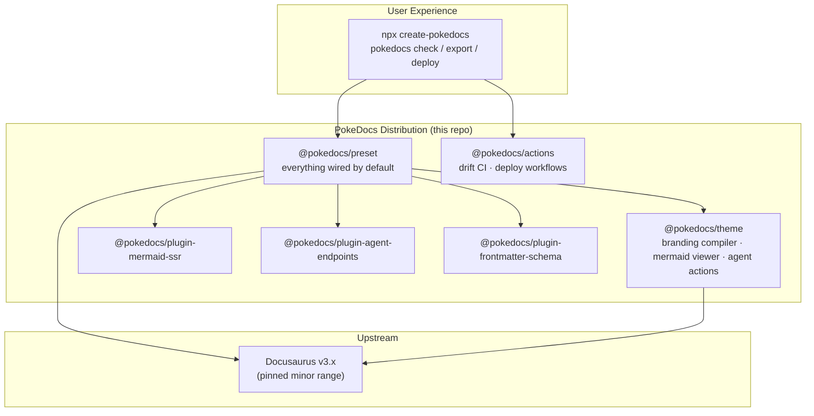

# Architecture

PokeDocs is **a distribution, not a fork**. Of the 14 differentiators identified in research, 13 fit Docusaurus's documented extension surfaces (preset, theme, plugins, CLI, CI templates). Users run `create-pokedocs` and never see the internals; PokeDocs tracks upstream minors and absorbs upstream improvements instead of fighting them.

## Package map

| Package | What it is |
|---|---|
| `create-pokedocs` | Scaffolder: docs-only template, agent authoring files, deploy target selection |
| `@pokedocs/preset` | The distribution core — wires theme, plugins, search, mermaid, agent endpoints by default |
| `@pokedocs/theme` | Branding compiler (config → full theme), mermaid interaction layer, page-level agent actions |
| `@pokedocs/plugin-mermaid-ssr` | Build-time mermaid → inline SVG + preserved source; build fails on bad syntax |
| `@pokedocs/plugin-agent-endpoints` | Emits `llms.txt`, `llms-full.txt`, per-page `.md` twins, discovery files — all static |
| `@pokedocs/plugin-frontmatter-schema` | Declarative frontmatter schemas, validated at build/check time |
| `pokedocs` (CLI) | `check`, `export pdf`, `deploy init`, `mcp` |
| `@pokedocs/actions` | GitHub Action templates: drift checker, AI doc updater, deploy pipelines |

## The one exception

Native markdown emission inside the SSG render pipeline — the fidelity ceiling for agent-readable output — genuinely can't be reached from plugin surfaces. It's pursued as an **upstream PR first** ([docusaurus#10899](https://github.com/facebook/docusaurus/issues/10899)); a fork is the last resort, gated behind an ADR.
