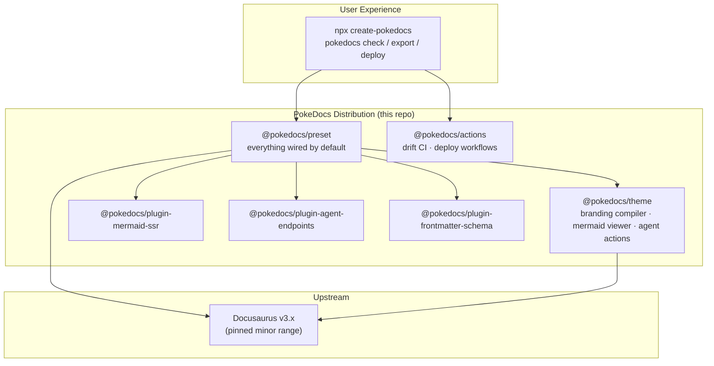
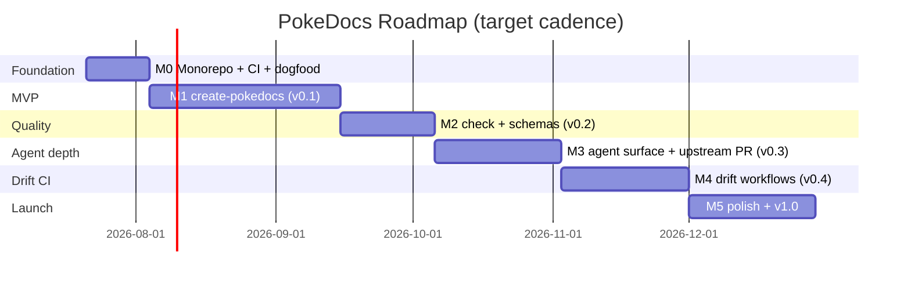

# PokeDocs — Product Requirements Document

| | |
|---|---|
| **Document** | PokeDocs PRD v1.0 |
| **Status** | Draft for review |
| **Author** | Wesley Huber |
| **Date** | July 14, 2026 |
| **Repo** | `pokedocs` (public) |

---

## 1. Executive Summary

**PokeDocs is an open-source, agent-native documentation framework built as a distribution on top of Docusaurus.** It ships the things every modern docs site needs but Docusaurus makes you assemble by hand — build-time mermaid diagrams, one-line branding, working search, agent-readable output (`llms.txt`, per-page markdown, MCP-ready discovery), docs-drift CI, and deploy-anywhere hosting kits — all on by default, from a single `create-pokedocs` command.

The core bet: **documentation now has two audiences — humans and AI agents — and no open-source framework serves both well.** Hosted platforms (Mintlify, GitBook) have made agent-readability table stakes but lock you to their infrastructure. Docusaurus is the most popular OSS docs framework but has shipped nothing for agents and leaves diagrams invisible to them. PokeDocs delivers the hosted-platform agent experience as **pure static build artifacts** that work on GitHub Pages, Vercel, Netlify, or a Docker container — no vendor, no server, no lock-in.

Strategy in one line: **a distribution, not a fork.** 13 of the 14 differentiating features identified in research are buildable on Docusaurus's documented extension surfaces (preset, theme, plugins, CLI, CI templates). Users run `create-pokedocs` and never see the internals; PokeDocs tracks upstream minors and absorbs upstream improvements instead of fighting them.

---

## 2. Why We Are Building This

This PRD is grounded in a structured audit (July 2026) of four production Docusaurus sites operated by the author — two startup/product docs sites (Helio, TrickBook) and two enterprise internal knowledge bases — plus research into upstream Docusaurus, the ElizaOS project's docs stack, and the 2025–2026 agent-docs ecosystem.

### 2.1 The evidence: the same failures, four times

Every one of the four audited sites independently hit the same walls:

- **Diagrams invisible to agents.** One site's 15 mermaid diagrams — its entire architecture documentation — render client-side only. The built HTML contains *no trace of the diagram, not even the mermaid source text*. Any agent or crawler reading the site cannot see the architecture at all. The upstream issue requesting build-time/SSR mermaid rendering (facebook/docusaurus#8299) has been open since 2022.
- **Theming fought and lost, four different ways.** Docusaurus branding requires hand-deriving a 7-shade color ladder in CSS. One site pasted the same hex into 4 of the 7 shades; another needed ~160 lines of overrides and a hand-picked substitute hue to pass contrast; a third resorted to eight `!important` rules. The top open theming issue upstream has 199 reactions and dates to 2020.
- **Zero working search, four for four.** The Docusaurus classic preset ships no search. One site had a search plugin *installed but never wired into config* — npm install and plugin activation are separate manual steps, so it silently shipped as a no-op. Offline/local search is the top-voted item on the Docusaurus feature board.
- **Docs drift managed by hand.** Freshness across the sites is commit messages like "update docs with current state," hand-typed "Last updated" strings, and manually pointing a coding agent at the repo when things drift too far. Correction commits — e.g. fixing which hardware revision a device doc described — show real factual drift reaching production docs.
- **Zero agent surface.** None of the four sites emit `llms.txt`, per-page markdown, or any machine-readable index — even where the primary consumers are AI retrieval pipelines and coding agents.
- **Bespoke pipelines for everything else.** Two sites built their own PDF export pipelines — one drifted from the sidebar it mirrors, the other hand-forks PDF variants of every doc; one hand-maintains an API reference across four backend repos because the generator plugin was never successfully wired up; hosting artifacts (Dockerfiles, nginx confs, deploy workflows) were re-invented per site, with one production bug shipped from a `url: localhost` config footgun.

Repeated pain across independent sites is the strongest product signal there is. Each of these is a PokeDocs feature.

### 2.2 The market signal: ElizaOS left Docusaurus

ElizaOS — one of the largest open-source AI agent frameworks — ran a substantial Docusaurus site (typedoc-generated API reference, mermaid diagrams on nearly every concept page, AI-powered docs CI) and **abandoned it for Mintlify**. What they gained is precisely the agent-native surface: `/llms.txt`, `/llms-full.txt`, every page served as raw markdown at `page.md`, HTTP discovery headers, and a hosted MCP server with semantic search. What they gave up: hosting freedom. Their docs — and even their MCP endpoint — now live on a closed hosted platform.

That trade is the market gap. **PokeDocs' positioning: everything ElizaOS left Docusaurus to get, as static files you can host anywhere, in open source.**

### 2.3 The data: coding agents read docs; crawlers don't (yet)

- llms.txt adoption is real but concentrated in dev tools (~10% of 300k surveyed domains; adopters include Anthropic, Stripe, Vercel, Cloudflare, Supabase).
- Monitoring of 500M+ AI bot visits found major AI *crawlers* (GPTBot, ClaudeBot, PerplexityBot) essentially never fetch llms.txt (~408 fetches total).
- But *coding agents* — Claude Code, Cursor, Cline, Windsurf, Aider — routinely fetch `/llms.txt` and `/llms-full.txt` when pointed at a docs site.

**Design consequence:** PokeDocs optimizes for tool-driven consumption (clean per-page markdown, full-corpus text, MCP discovery), not for crawler SEO. Crawler-facing wins (SVG diagrams inline in HTML, semantic markup) come free from build-time rendering.

### 2.4 The competitive gap

| Capability | Docusaurus | VitePress/Nuxt | Fumadocs | Mintlify / GitBook | **PokeDocs** |
|---|---|---|---|---|---|
| llms.txt / llms-full.txt | Community plugins only | Near-core plugins | Documented patterns | ✅ Automatic | ✅ Default, static |
| Per-page `.md` twins | Community plugin | Plugin | ✅ Prerendered | ✅ (server-side) | ✅ Static files |
| MCP for docs | Community plugin | ✗ | ✗ | ✅ Hosted | ✅ Static-compatible |
| Build-time mermaid (SVG in HTML) | ✗ (open since 2022) | ✗ | ✗ | Partial | ✅ Default |
| Config-only branding | ✗ (CSS ladder) | Partial | Partial | ✅ (`docs.json`) | ✅ Schema-validated |
| Docs-drift CI | ✗ | ✗ | ✗ | Proprietary agents | ✅ OSS templates |
| Local search default | ✗ | One-line opt-in | ✅ | ✅ | ✅ |
| Host anywhere | ✅ | ✅ | Next.js required | ✗ Locked | ✅ |
| Open source | ✅ | ✅ | ✅ | ✗ | ✅ |

No incumbent occupies the cell PokeDocs targets: **OSS + host-anywhere + agent-native + diagram-native + drift-aware.**

---

## 3. Who We Are Building For

### P1 — The multi-project builder *(primary)*
Indie hacker / founder / senior dev maintaining docs for 2–5 products on nights and weekends. Wants a branded, searchable, diagram-rich docs site in minutes, not a fifth part-time job. Today they copy-paste a previous site's config and inherit its bugs.
**Success looks like:** `npx create-pokedocs`, set `brandColor` and logo, push, done — search, diagrams, llms.txt, and deploy workflow all working on day one.

### P2 — The OSS maintainer
Maintains a framework or library whose users increasingly arrive via coding agents. Needs docs that agents can ingest cleanly (their support burden drops when Claude Code answers correctly). Will not move docs to a paid closed platform on principle and because contributors need to edit markdown in the repo.
**Success looks like:** every release, docs regenerate and agents pick up accurate API references; `llms-full.txt` and MCP work without any server they have to run.

### P3 — The platform / docs engineer
Runs internal knowledge bases at a company — possibly feeding retrieval pipelines — behind the firewall. Needs frontmatter contracts enforced in CI (a typo in a metadata field can silently break retrieval or leak content past an ingest boundary), self-hosting (Docker/nginx), and deterministic quality gates a compliance review can trust.
**Success looks like:** `pokedocs check` in CI blocks malformed docs before merge; the Docker image is maintained by the framework, not by them.

### P4 — Coding agents *(first-class users, not an afterthought)*
Claude Code, Codex, Cursor, Cline, and their successors, consuming docs on behalf of P1–P3's users. They need: a discoverable index (`llms.txt`), full-corpus text (`llms-full.txt`), clean per-page markdown with code fences and mermaid *source* intact, stable anchors, and machine-validated metadata.
**Success looks like:** an agent pointed at any PokeDocs site answers architecture questions correctly *including reading the diagrams* — because the mermaid source ships alongside the rendered SVG.

### P5 — Answer engines & AI crawlers *(secondary)*
Whatever Google/OpenAI/Anthropic crawlers converge on, PokeDocs sites should already satisfy: content and diagrams present in static HTML, semantic structure, sitemaps, standard discovery files. We track the space but don't bet the roadmap on crawler behavior.

---

## 4. Product Vision & Pillars

> **Docs that humans love and agents can actually read — built in minutes, hosted anywhere.**

1. **Diagram-native.** Mermaid is a first-class content type: rendered to SVG at build time (humans/crawlers), source preserved in HTML and markdown outputs (agents), syntax-validated in CI (authors), interactive in the browser (readers).
2. **Branded in one line.** `brandColor`, logo, font in config → a complete, contrast-checked, dark-mode-correct theme. No CSS ladders, no swizzling.
3. **Drift-aware.** The framework ships the CI that keeps docs honest: deterministic checks a green build doesn't give you, code-to-doc coupling, and AI doc-update workflows triggered by code PRs.
4. **Agent-readable by default.** Every build emits the full agent surface as static artifacts. If it's on the web, an agent can ingest it — no server, no vendor.
5. **Host anywhere.** GitHub Pages, Vercel, Netlify, Docker/nginx — first-class and footgun-free; Amplify, Cloudflare, and any other static host compatible by construction.

---

## 5. Strategy: A Distribution, Not a Fork

Research verdict: of 14 validated differentiators, **13 require no fork** — they fit Docusaurus's documented extension surfaces. Upstream is highly active (65k+ stars, releases every 1–3 months) with a breaking v4 imminent (Node 24, React 19.2, Rspack 2). A hard fork would spend the project's entire maintenance budget tracking upstream instead of building differentiators — and gets stranded if upstream later ships official agent features, whereas a distribution absorbs them.



**Package map**

| Package | What it is |
|---|---|
| `create-pokedocs` | Scaffolder: docs-only template, agent authoring files, deploy target selection |
| `@pokedocs/preset` | The distribution core — wires theme, plugins, search, mermaid, agent endpoints by default |
| `@pokedocs/theme` | Branding compiler (config → full theme), mermaid interaction layer, page-level agent actions |
| `@pokedocs/plugin-mermaid-ssr` | Build-time mermaid → inline SVG + preserved source; build fails on bad syntax |
| `@pokedocs/plugin-agent-endpoints` | Emits `llms.txt`, `llms-full.txt`, per-page `.md` twins, discovery files — all static |
| `@pokedocs/plugin-frontmatter-schema` | Declarative frontmatter schemas, validated at build/check time |
| `pokedocs` (CLI) | `check`, `export pdf`, `deploy init`, `mcp` |
| `@pokedocs/actions` | GitHub Action templates: drift checker, AI doc updater, deploy pipelines |

**Upstream policy**

- Pin Docusaurus minor range; upgrade deliberately, with the dogfood site as canary.
- The **one fork-level item** — native markdown emission inside the SSG render pipeline (today plugins either round-trip built HTML back to markdown or strip MDX heuristically; neither can resolve theme components to faithful text) — is pursued as an **upstream PR first** (issue #10899; maintainer sympathy on record since May 2025). A thin patch layer is the fallback; a true fork is the last resort.
- Absorb, don't compete: if upstream ships official llms.txt support, PokeDocs adopts it and keeps differentiating on diagrams, branding, and drift CI. The closest existing plugin (SignalWire's llms-txt suite, ~107k downloads/month) validates demand; PokeDocs' edge is integration-by-default plus the pieces a standalone plugin can't reach.

---

## 6. MVP Definition

**MVP statement:** *A developer runs one command and gets a branded, searchable, diagram-native, agent-readable docs site deployed to the host of their choice — in under 10 minutes.*

**In scope (Milestones M0 + M1):** monorepo + CI foundation; `create-pokedocs` scaffolder; the preset with build-time mermaid, one-line branding v1, agent endpoints v1 (llms.txt / llms-full.txt / `.md` twins), local search, and deploy scaffolds for GitHub Pages, Vercel, Netlify, and Docker.

**Out of scope for MVP (later milestones):** `pokedocs check` linter, frontmatter schemas, drift CI, MCP server, PDF export, API-reference wiring, mermaid zoom/pan, WCAG auto-contrast, social-card generation.

**MVP exit criteria**

1. `npx create-pokedocs my-docs` → `npm run build` succeeds on a clean machine; output passes: SVG diagrams present in HTML with mermaid source preserved; `llms.txt`, `llms-full.txt`, and `.md` twins emitted; search works offline.
2. **Both of the author's product docs sites (Helio, TrickBook) are migrated to PokeDocs** and deployed on their current hosts with no regressions — the dogfood gate.
3. A coding agent (Claude Code) pointed at a deployed MVP site can enumerate pages via `llms.txt`, fetch any page as markdown, and correctly describe a mermaid-diagrammed architecture.
4. Time from `create-pokedocs` to a live deployed site ≤ 10 minutes, measured fresh.

---

## 7. Roadmap

| Version | Theme | Milestone |
|---|---|---|
| v0.0.x | Foundation: monorepo, CI, dogfood site | M0 |
| v0.1 | **MVP: create-pokedocs** — branded, diagram-native, agent-readable, host-anywhere | M1 |
| v0.2 | Quality gates: `pokedocs check` + frontmatter schemas | M2 |
| v0.3 | Agent-native depth: page actions, discovery, MCP, upstream markdown-emission PR | M3 |
| v0.4 | Docs-drift CI: the moat | M4 |
| v1.0 | Interaction & export polish, hardening, launch | M5 |



Dates are targets for a nights-and-weekends cadence, not commitments; milestones are strictly ordered, versions cut at milestone completion.

---

## 8. Milestones → Features → User Stories

Conventions: each story below becomes one GitHub issue titled `[S<id>] <story title>`, labeled by milestone (`M1`), feature (`F1.3`), and package. Acceptance criteria are the issue's definition of done. Personas referenced as P1–P5 (§3).

---

### M0 — Foundation (v0.0.x)

Goal: a monorepo any contributor (human or agent) can build, test, and release from.

#### F0.1 Monorepo scaffold
Workspace tooling (pnpm workspaces), TypeScript config, package skeletons for every package in §5, MIT license, contributor docs.

- **S0.1.1 — Bootstrap the workspace**
  *As a maintainer, I want a pnpm-workspace monorepo with package skeletons for preset/theme/plugins/CLI, so that every subsequent feature has a home and builds from day one.*
  Acceptance: `pnpm install && pnpm build` succeeds from clean clone; each package publishes a valid (empty-but-typed) entry point; root README documents the layout.
- **S0.1.2 — Agent-ready contributor surface**
  *As a coding agent contributing to PokeDocs, I want CLAUDE.md/AGENTS.md with build commands, conventions, and package map, so that I can make correct changes without spelunking.*
  Acceptance: CLAUDE.md and AGENTS.md at repo root; a fresh Claude Code session can build and test the repo following only those files.

#### F0.2 CI and release automation
- **S0.2.1 — CI on every PR**
  *As a maintainer, I want lint, typecheck, build, and tests running on every PR, so that main is always releasable.*
  Acceptance: GitHub Actions workflow green on a trivial PR; failures block merge via branch protection.
- **S0.2.2 — Versioned releases with changesets**
  *As a maintainer, I want changesets-driven versioning and npm publish automation, so that releases are one merge, not a ritual.*
  Acceptance: merging a changeset PR publishes packages to npm with correct semver and changelogs.

#### F0.3 Dogfood docs site
- **S0.3.1 — PokeDocs documents itself with PokeDocs**
  *As a maintainer, I want the project's own docs site built with the in-repo packages, so that every feature is exercised before release.*
  Acceptance: `docs-site/` in the monorepo consumes workspace packages; deploys on merge to main; serves as the canary for upstream Docusaurus upgrades.

---

### M1 — MVP: `create-pokedocs` (v0.1)

Goal: the 10-minute branded, diagram-native, agent-readable site. This is the milestone that must feel magical.

#### F1.1 `create-pokedocs` scaffolder
A docs-only template with zero cruft — no demo blog, no placeholder SVGs, no template comments — plus agent authoring files.

- **S1.1.1 — Scaffold a docs-only site**
  *As P1, I want `npx create-pokedocs my-docs` to generate a docs-only site (docs at root path, autogenerated sidebar, config-driven landing page), so that I skip the boilerplate-deletion hour every new site starts with.*
  Acceptance: generated site builds clean; no blog directory, demo content, or template comments; docs served at `/`; landing page (hero + card grid) driven entirely by config.
- **S1.1.2 — Generated agent authoring scaffold**
  *As P4, I want the scaffold to include a CLAUDE.md/AGENTS.md encoding the site's authoring conventions (frontmatter, sidebar rules, mermaid guidance), so that agent-written docs are right the first time.*
  Acceptance: files generated with project-specific values interpolated; conventions match what the preset actually enforces.
- **S1.1.3 — Interactive setup**
  *As P1, I want the scaffolder to ask for site name, brand color, logo path, and deploy target, so that the generated site is already mine.*
  Acceptance: prompts with sensible defaults and non-interactive flags (`--brand-color`, `--deploy github-pages`); values land in config; `--yes` produces a working default site.

#### F1.2 `@pokedocs/preset` — everything on by default
The anti-"installed but never wired" feature: activation is the preset's job, never the user's.

- **S1.2.1 — One preset, fully wired**
  *As P1, I want a single `@pokedocs/preset` entry in config to activate theme, mermaid SSR, search, and agent endpoints, so that installing a capability and enabling it are never separate steps.*
  Acceptance: a config containing only the preset + site metadata produces a site with all M1 capabilities active; each capability can be disabled via one preset option.
- **S1.2.2 — Config validation with human errors**
  *As P1, I want schema-validated preset options with actionable error messages, so that misconfiguration fails at build start, not silently at runtime.*
  Acceptance: invalid option → build fails immediately, names the bad key, shows the expected shape and an example; validation covers all preset options.

#### F1.3 Build-time mermaid rendering (`@pokedocs/plugin-mermaid-ssr`)
The flagship. Diagrams become dual human+agent artifacts, and diagram errors become build errors.

- **S1.3.1 — SVG baked into static HTML**
  *As P5 (and any no-JS reader), I want every ```mermaid fence compiled to inline SVG at build time, so that diagrams exist in the HTML without JavaScript.*
  Acceptance: built HTML contains the SVG; no client-side mermaid required for initial render; no flash-of-no-diagram; default light/dark mermaid themes follow the site color mode (brand-derived diagram palettes arrive in S5.1.2).
- **S1.3.2 — Mermaid source preserved for agents**
  *As P4, I want the original mermaid source retained in the DOM alongside the SVG and verbatim in all markdown/llms outputs, so that I can read the diagram's semantics, not pixels.*
  Acceptance: source present in built HTML (data attribute or script tag) and in `.md` twins / `llms-full.txt` as fenced mermaid blocks, byte-identical to the author's source.
- **S1.3.3 — Build fails on invalid mermaid, with file and line**
  *As a docs author, I want a mermaid syntax error to fail the build pointing at file and line, so that broken diagrams never ship and I don't discover them in a browser.*
  Acceptance: invalid diagram → non-zero exit, error names file, line, and the mermaid parser message; valid diagrams unaffected; error format matches Docusaurus's own broken-link errors in spirit.
- **S1.3.4 — SSR engine spike & decision**
  *As the maintainer, I want a spike comparing build-time rendering approaches (rehype-mermaid integration vs. mermaid-cli at build) on cold build time, CI-friendliness (no surprise browser downloads), and output fidelity, so that F1.3 is built on the right engine (resolves Open Question 2).*
  Acceptance: both approaches benchmarked on the dogfood corpus; decision recorded as an ADR with the numbers.

#### F1.4 One-line branding v1 (`@pokedocs/theme`)
- **S1.4.1 — brandColor to full theme**
  *As P1, I want to set `brandColor` (plus optional logo, favicon, font) in config and get the complete computed theme — full shade ladders for light and dark modes, navbar/footer/buttons styled — so that I never hand-derive an Infima CSS ladder again.*
  Acceptance: single `branding` config block produces a correct 7-shade primary ladder per color mode; no `custom.css` required for a branded site; logo supports light/dark variants; computed values inspectable via a debug flag.
- **S1.4.2 — Dark mode correct by construction**
  *As P1, I want dark-mode shades derived with correct lightness direction automatically, so that I can't repeat the classic mistake of darkening the primary color for dark mode.*
  Acceptance: generated dark palette is measurably lighter than light-mode primary per Infima guidance; snapshot tests cover representative brand colors including very light and very dark brands.

#### F1.5 Agent endpoints v1 (`@pokedocs/plugin-agent-endpoints`)
- **S1.5.1 — llms.txt and llms-full.txt on every build**
  *As P4, I want every build to emit `/llms.txt` (page index with titles/descriptions/md-URLs) and `/llms-full.txt` (full corpus), so that I can discover and ingest the whole site in two fetches.*
  Acceptance: files emitted to build output as static artifacts; conform to llmstxt.org conventions; index entries carry frontmatter descriptions; corpus preserves code fences and mermaid source; excluded pages (drafts, noindex) respected.
- **S1.5.2 — Per-page markdown twins**
  *As P4, I want every HTML page to have a `.md` twin at the same path (e.g. `/architecture` → `/architecture.md`), so that I fetch clean markdown instead of scraping hydrated HTML.*
  Acceptance: twin emitted for every doc page; headings/anchors match the HTML page; works as plain static files on any host (verified on GitHub Pages and nginx).
- **S1.5.3 — Discovery links in HTML**
  *As P4, I want `<link rel="alternate">` tags pointing from each HTML page to its `.md` twin and the site index, so that I can discover the machine-readable surface from any entry URL.*
  Acceptance: link tags present on every page; llms.txt referenced from a stable, documented location.

#### F1.6 Local search on by default
- **S1.6.1 — Working search with zero signup**
  *As P1's readers, I want full-text search working out of the box with no external service, so that the docs are navigable from day one.*
  Acceptance: preset bundles and activates a local search engine (choice per S1.6.2); works offline and on static hosts; Algolia documented as opt-in upgrade; search UI matches the theme.
- **S1.6.2 — Search engine benchmark & decision**
  *As the maintainer, I want the candidate local search engines (pagefind-style vs. lunr-family) benchmarked on the dogfood corpus for index size, query latency, and result quality, so that F1.6 ships the right default (resolves Open Question 1).*
  Acceptance: benchmark numbers recorded as an ADR; decision wired into the preset.

#### F1.7 Host-anywhere kit v1
Vercel/Netlify/Amplify auto-detect Docusaurus builds, so they get verified documentation, not scaffolding; scaffolding effort goes where it's actually needed.

- **S1.7.1 — `pokedocs deploy init` plumbing + GitHub Pages target**
  *As P1, I want `pokedocs deploy init github-pages` to scaffold the proven Pages workflow (build + upload-pages-artifact + deploy-pages + CNAME/.nojekyll handling), so that deployment is generated, not researched.*
  Acceptance: command plumbing supports pluggable targets; the Pages workflow is verified against a real deploy from a fresh scaffold; Vercel/Netlify documented as verified zero-config paths.
- **S1.7.2 — Docker/nginx target**
  *As P3, I want `pokedocs deploy init docker` to generate a maintained multi-stage Dockerfile + nginx conf, so that self-hosting doesn't mean hand-building server config per site.*
  Acceptance: image builds and serves a scaffolded site; nginx `try_files` correct for the configured base path; non-root runtime; verified against a real container run.
- **S1.7.3 — baseUrl footgun elimination**
  *As P1, I want `url`/`baseUrl` conventions from environment with a build-time warning when a production build carries a localhost-like URL, so that the classic "shipped with url: localhost" bug can't happen.*
  Acceptance: production build with localhost-like `url` emits a prominent warning (opt-in flag to make it an error); env-var override documented and scaffolded.

---

### M2 — Quality gates (v0.2)

Goal: catch everything a green build doesn't. This milestone productizes checks previously maintained as out-of-band scripts.

#### F2.1 `pokedocs check` — the docs linter
- **S2.1.1 — Syntax hazards, fast**
  *As a docs author, I want a fast check that catches both the silent breakages a green build ships (broken admonition syntax — `:::warning Title` vs `:::warning[Title]` — unclosed fences/admonitions, mermaid label pitfalls) and MDX3 compile hazards (`<digit` parsed as JSX, brace escaping) in seconds without a production build, so that "build passed" stops meaning "docs might still be broken" and compile errors surface while I'm still editing.*
  Acceptance: each listed class has fixture-backed tests (bad input → precise finding with file/line; good input → silent); runs in seconds without a production build.
- **S2.1.2 — Structural checks: orphans and sidebar drift**
  *As P3, I want detection of pages unreachable from any sidebar and sidebar entries pointing at missing files, so that content can't silently fall out of navigation.*
  Acceptance: orphaned-page and dangling-entry findings with paths; respects intentional exclusions via frontmatter/config.
- **S2.1.3 — CI and pre-commit modes**
  *As P3, I want `pokedocs check` as a pre-commit hook and a CI step with machine-readable output, so that quality gates run where the work happens.*
  Acceptance: `--format json` and GitHub-annotations output; documented pre-commit config; non-zero exit on findings above a configurable severity.

#### F2.2 Frontmatter schemas (`@pokedocs/plugin-frontmatter-schema`)
- **S2.2.1 — Declarative schemas per directory or doc type**
  *As P3, I want to declare frontmatter schemas in config (required fields, enums, dates — e.g. `audience`, `owner`, `last_verified`, an ADR status enum), so that metadata contracts are enforced by the build, not by a contributing guide.*
  Acceptance: schema violations fail build/check with file, field, and expected type/enum; schemas can target directories or doc types; zero-config default is permissive.
- **S2.2.2 — Validated metadata flows to the agent surface**
  *As P4, I want validated custom frontmatter emitted into llms.txt entries and a minimal JSON page index, so that downstream retrieval pipelines can rely on it.*
  Acceptance: configured fields appear in the emitted index (this index is the seed that F3.2 extends into the full discovery index); documented as a stable contract; `ingest: false`-style exclusion honored across every agent artifact (twins, corpus, index).

---

### M3 — Agent-native depth (v0.3)

Goal: from "agents can read it" to "agents are first-class users" — and take the fidelity ceiling upstream.

#### F3.1 Page-level agent actions (`@pokedocs/theme`)
- **S3.1.1 — Copy as Markdown / Open in agent**
  *As a reader working with an AI assistant, I want per-page "Copy as Markdown" and "Open in Claude/ChatGPT" actions, so that moving a page into my agent's context is one click.*
  Acceptance: buttons on every doc page, theme-consistent, configurable targets; copy payload is the `.md` twin content; graceful degradation without JS.

#### F3.2 Discovery surface
- **S3.2.1 — Well-known discovery files**
  *As P4, I want an enumerated set of discovery artifacts — `/skill.md`, `/.well-known/pokedocs.json` (site manifest: name, version, routes to llms/index artifacts), and the full JSON site index (routes, titles, validated metadata; extends the S2.2.2 seed) — so that tools can auto-configure against any PokeDocs site.*
  Acceptance: exactly these artifacts emitted statically on every build; each format documented with a schema; filenames stable and versioned in the manifest.
- **S3.2.2 — Discovery-conventions ADR**
  *As the maintainer, I want a written compatibility stance on emerging agent-discovery conventions (Mintlify skill.md, agent-card patterns, llms.txt evolution), so that S3.2.1's artifact set tracks the ecosystem deliberately instead of ad hoc.*
  Acceptance: ADR published in the repo naming which conventions we emit, which we watch, and the review cadence.

#### F3.3 MCP story
- **S3.3.1 — Static-first MCP compatibility**
  *As P4, I want every PokeDocs site consumable through existing static-friendly MCP bridges (GitMCP-style) via its emitted artifacts, so that MCP access requires no server from the site owner.*
  Acceptance: documented, tested recipe connecting Claude Code to a PokeDocs site's content via its static artifacts; gaps that force server-side MCP are identified and fed into S3.3.2.
- **S3.3.2 — `pokedocs mcp` (optional local server)**
  *As P2, I want an optional `pokedocs mcp` command serving search + page tools over the built site, so that teams wanting richer MCP (semantic search) can run it themselves — no vendor.*
  Acceptance: MCP server exposes documented search/fetch tools over a built site directory; works pointed at any PokeDocs build output; explicitly optional.

#### F3.4 Upstream: native markdown emission (the one fork-level item)
- **S3.4.1 — Spike: markdown emission inside the SSG pipeline**
  *As the maintainer, I want a working spike that renders clean markdown directly from compiled MDX during the build (theme components resolved to text equivalents, mermaid/code fences and anchors preserved), so that we know the real cost and quality ceiling versus post-build conversion approaches.*
  Acceptance: spike renders a non-trivial corpus; fidelity compared against the existing plugins' output (HTML round-trip and MDX-stripping approaches) with documented examples; approach written up.
- **S3.4.2 — Upstream RFC/PR to Docusaurus**
  *As the maintainer, I want the spike proposed upstream on issue #10899, so that the fidelity ceiling gets fixed at the source and PokeDocs never needs a fork.*
  Acceptance: RFC/PR opened with the spike's evidence; outcome (accepted / rejected / stalled after one quarter) recorded as an ADR that selects: upstream code, thin patch layer, or status quo.

---

### M4 — Docs-drift CI (v0.4)

Goal: the moat. No *docs-site-aware* OSS answer exists — commercial players charge for theirs, and generic CI doc-agents don't know the site's structure. PokeDocs' edge is that its workflows read the site's own manifest and index artifacts, and run deterministic gates before any LLM does.

#### F4.1 Drift workflow templates (`@pokedocs/actions`)
- **S4.1.1 — PR-triggered AI doc updater**
  *As P2, I want a scaffolded GitHub Actions workflow where, on PRs to my code repo, an AI agent reads the diff, compares it against the docs corpus (via the site's llms/index artifacts), and pushes suggested doc updates or opens a docs PR, so that docs drift is caught at the moment code changes.*
  Acceptance: template workflow using agent-mode claude-code-action (or compatible); configurable for docs-in-repo and separate-docs-repo layouts; AI step is continue-on-error so API flakiness never blocks merges; deterministic `pokedocs check` gate runs first; dogfooded on the author's sites.
- **S4.1.2 — Scheduled docs maintainer**
  *As P1, I want a scheduled workflow reviewing recent commits for undocumented changes and opening a summary issue/PR, so that drift gets swept even when per-PR automation is off.*
  Acceptance: cron template produces a drift report referencing specific commits and affected docs; noise-controlled (no empty reports).

#### F4.2 Deterministic code-coupling
- **S4.2.1 — Pin docs to code paths and symbols**
  *As P3, I want frontmatter like `coupled: [repo:src/auth/**, repo:api/routes.ts#login]` binding a doc to code locations, so that CI can flag "code this doc references changed" cheaply, deterministically, and before any LLM runs.*
  Acceptance: coupling syntax documented; CI action diffs incoming PRs against couplings and comments/flags affected docs; zero API keys required for the deterministic pass; flagged set optionally handed to the F4.1 AI updater.
- **S4.2.2 — Coupling health surfaced**
  *As P3, I want `pokedocs check` to validate couplings (paths/symbols that no longer exist) and report coverage, so that the coupling map itself doesn't rot.*
  Acceptance: dead couplings reported with doc + target; coverage summary (docs with/without couplings) available.

#### F4.3 API reference wiring
- **S4.3.1 — typedoc by config**
  *As P2, I want `apiReference: { typedoc: { entry: '...' } }` in the preset to wire TypeScript API reference generation — pages in the sidebar, entries in llms.txt, no separate plugin-array step — so that API references are generated, not hand-mirrored.*
  Acceptance: config-only activation wrapping the maintained typedoc ecosystem plugin; generated pages appear in sidebar and agent artifacts; CI regeneration recipe documented (composes with F4.1/F4.2).
- **S4.3.2 — OpenAPI by config**
  *As P2, I want `apiReference: { openapi: 'specs/api.yaml' }` to generate per-endpoint reference pages the same way, so that REST APIs get the same treatment as TypeScript ones.*
  Acceptance: config-only activation wrapping the maintained OpenAPI ecosystem plugin; sidebar and agent artifacts include generated pages; CI regeneration recipe documented.

---

### M5 — Polish & v1.0

Goal: the details that separate adopted from admired — then launch.

#### F5.1 Mermaid interaction layer
- **S5.1.1 — Zoom, pan, fullscreen**
  *As a reader, I want zoom/pan/fullscreen on diagrams, so that large architecture diagrams are actually readable.*
  Acceptance: controls on every diagram without per-site code; keyboard accessible; no MutationObserver-on-internals hacks — implemented as a supported theme component; interaction code lazy-loads only on pages containing diagrams (no site-wide bundle cost).
- **S5.1.2 — Theme-synced diagram palettes and known-bug fixes**
  *As P1, I want mermaid colors derived from my brand palette per color mode, and the known tab-render/dark-contrast bugs fixed in the shipped viewer, so that diagrams look native to my site in both modes.*
  Acceptance: diagram palette derives from branding config; per-color-mode diagram options supported; regression tests for diagrams-in-tabs and dark-mode contrast.

#### F5.2 Export pipeline
- **S5.2.1 — `pokedocs export pdf`**
  *As P3, I want per-doc and combined PDF export that reuses the build-time-rendered SVGs, derives order from the actual sidebar, and applies the site theme, so that deliverable PDFs stop being bespoke scripts with drifting section lists.*
  Acceptance: single command produces themed PDF(s); document order comes from the sidebar (no parallel list to maintain); mermaid renders as vector; fails loudly on errors.

#### F5.3 Theming polish
- **S5.3.1 — WCAG auto-contrast**
  *As P1, I want the branding compiler to contrast-check computed colors and auto-substitute accessible variants (with a warning), so that brand-colored text never ships unreadable.*
  Acceptance: WCAG AA checks on key surface pairs; failing brand colors get nearest-accessible substitution + build warning; override flag for intentional choices.
- **S5.3.2 — Generated social cards**
  *As P1, I want per-page social card images generated from my branding at build time, so that shared links look intentional without design work.*
  Acceptance: cards generated with brand color/logo/page title; overridable per page; default replaces the stock Docusaurus card.

#### F5.4 v1.0 hardening & launch
- **S5.4.1 — Migration guide and codemod from stock Docusaurus**
  *As P2 on an existing Docusaurus site, I want a migration guide and codemod that moves my site onto the preset, so that adoption doesn't require a rebuild.*
  Acceptance: codemod migrates a classic-preset site (config transform, custom.css → branding block where derivable); guide validated by migrating a real external site.
- **S5.4.2 — Launch**
  *As the maintainer, I want a coordinated launch (docs site live on PokeDocs itself, comparison page, Show HN / community posts), so that v1.0 meets its audience.*
  Acceptance: launch checklist executed — dogfood docs site live on PokeDocs; comparison page substantiating every §2.4 claim against current versions; trademark clearance confirmed (§10, §12 Q4); v1.0 packages published; announcement posts (Show HN, relevant communities) shipped.

---

## 9. Success Metrics

| Metric | 6 months post-MVP | 12 months |
|---|---|---|
| npm downloads of `@pokedocs/preset` | 2k/month | 20k/month |
| GitHub stars | 500 | 3,000 |
| `create-pokedocs` → deployed site (measured, fresh machine) | ≤ 10 min | ≤ 5 min |
| Author's product docs sites migrated (dogfood) | 2 of 2 | all active sites |
| External sites in the wild serving PokeDocs llms.txt | 25 | 250 |
| Upstream PR (S3.4.2) resolved | decision recorded | merged or ADR'd fallback |

Qualitative gate at each milestone: point Claude Code at the dogfood site cold and grade its answers about the documented system — the agent-experience regression test.

---

## 10. Risks & Mitigations

| Risk | Likelihood | Impact | Mitigation |
|---|---|---|---|
| Docusaurus v4 breaking changes land mid-build | High | Medium | Distribution (not fork) + pinned minors + dogfood canary; schedule a v4 compatibility milestone when beta ships |
| Upstream ships official llms.txt, eroding pillar 4 | Medium | Medium | Absorb it in the preset; differentiation concentrates in mermaid SSR, branding, drift CI — which upstream has signaled no plans for |
| SignalWire/community plugins close the agent-endpoint gap | Medium | Low | Their traction validates demand; PokeDocs competes on integration-by-default and the full surface, and can depend on best-of-breed plugins rather than reimplement |
| GitHub Agentic Workflows (first-party, preview June 2026) commoditizes generic doc-update CI, aimed at M4 "the moat" | Medium | High | Differentiate on what generic workflows can't have: docs-site awareness (the manifest/index artifacts) and deterministic coupling gates (F4.2) that run before any LLM; ship templates compatible with gh-aw runners rather than competing on the runner itself |
| **Name risk: "PokeDocs" adjacency to a famously litigious trademark** | Low–Medium | High | Legal sanity check before public launch; name is not Pokémon-themed and docs tooling is a distant class, but verify and keep a rename cheap (no name-load-bearing APIs) before v0.1 announce |
| Solo-maintainer bandwidth | High | High | Strict milestone ordering; agent-first contribution setup (S0.1.2) so coding agents carry mechanical load; every feature must reduce the author's own four-site maintenance burden (immediate ROI) |
| llms.txt standard churn / crawler indifference persists | Medium | Low | Surface is cheap static artifacts; target coding agents (proven consumers), track standards in F3.2 |
| AI doc-updater quality (hallucinated docs) | Medium | Medium | Deterministic gates first (F2.1, F4.2); AI output always lands as reviewable PRs, never direct commits |

---

## 11. Non-Goals

- **Not a hosted platform.** No PokeDocs cloud, no accounts. (Revisit only post-v1.0 with real demand evidence.)
- **Not a new SSG.** Docusaurus underneath; we don't compete with it, we complete it.
- **Not a hard fork** — unless the S3.4.2 upstream path fails *and* fidelity demands it (ADR-gated).
- **Not a general website builder.** Docs-only focus is the point.
- **Not crawler-SEO tooling.** We serve agents and humans; crawler behavior is tracked, not chased.
- **Not (yet) code-to-diagram generation.** Auto-generating mermaid from code (dependency-cruiser-style, DeepWiki-style) is genuinely open territory in our lane — deliberately deferred until after v1.0 so it doesn't dilute the milestones above; revisit as a v1.x flagship.

## 12. Open Questions

1. Search engine choice for F1.6 (pagefind vs. lunr-family) — resolved by S1.6.2's benchmark during M1.
2. Mermaid SSR engine (mermaid-cli/puppeteer at build vs. rehype-mermaid integration) — resolved by S1.3.4's spike at M1 start.
3. Where drift-CI config lives (docs repo vs. code repo vs. both) for the separate-repos layout — resolve during F4.1 design with the Helio multi-repo case as the test.
4. Trademark clearance timing for the name (see Risks) — before first public announcement.
5. CLI site-context: Docusaurus CLI commands aren't natively site-context-aware (upstream discussion #11191); `pokedocs check`/`export` likely rely on context cached at build time (e.g. from `postBuild`) — validate this constraint during F2.1 design.

## 13. Next Steps

1. Review and ratify this PRD (v1.0 → Approved).
2. Create the public GitHub repo; seed labels (`M0`–`M5`, `F*` feature labels, package labels).
3. Generate GitHub issues from §8 user stories (one issue per story, milestone-assigned).
4. Begin M0: S0.1.1 monorepo bootstrap.

---

*Appendix A — Research provenance: this PRD synthesizes a July 2026 multi-agent research pass: structured audits of four production Docusaurus sites; upstream analysis of facebook/docusaurus v3.10.x (issues #8299, #10899, #2961, #10251, #8357, PR #11420, v4 umbrella plans); ElizaOS docs-stack archaeology (Docusaurus era → Mintlify migration, docs-ci.yml automation); and ecosystem research covering llms.txt adoption data, Mintlify/GitBook/Fumadocs agent features, SignalWire's Docusaurus llms-txt plugin suite, and docs-freshness CI patterns (claude-code-action agent mode, Swimm, Dosu).*
